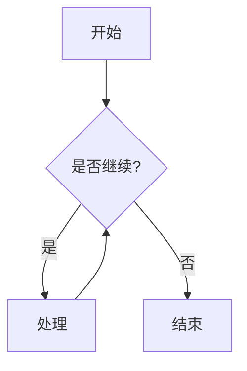

# Quartz功能测试

这是一个用于测试Quartz各项功能的示例文档。我们将展示各种Markdown语法和特殊功能。

## 基础Markdown语法

### 列表测试

无序列表：
- 苹果
- 香蕉
- 橙子

有序列表：
1. 第一项
2. 第二项
3. 第三项

### 文本格式

- **粗体文本**
- *斜体文本*
- ~~删除线文本~~
- `行内代码`

### 引用

> 这是一段引用文本
> 可以有多行
> 用于突出显示重要内容

### 代码块

```python
def hello_world():
    print("Hello, Quartz!")
    return True

# 调用函数
hello_world()
```

### 表格

| 功能 | 支持情况 | 备注 |
|------|----------|------|
| 基础Markdown | ✅ | 完全支持 |
| Wiki链接 | ✅ | [[wikilinks]] |
| 数学公式 | ✅ | 支持LaTeX |

## Quartz特殊功能

### Callouts

> [!note] 提示
> 这是一个提示性的Callout

> [!warning] 警告
> 这是一个警告性的Callout

### Mermaid图表



### LaTeX数学公式

行内公式：$E = mc^2$

独立公式：
$$
\frac{d}{dx}\left( \int_{0}^{x} f(u)\,du\right)=f(x)
$$

### 图片链接


## 交叉引用

- 查看 [[index|首页]]
- 了解更多 [[features/wikilinks|Wiki链接]]

---

这个测试文档展示了Quartz支持的主要功能。你可以基于这个模板进行进一步的测试和定制。